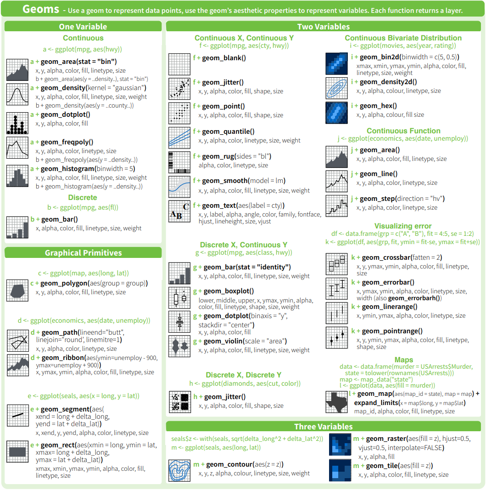
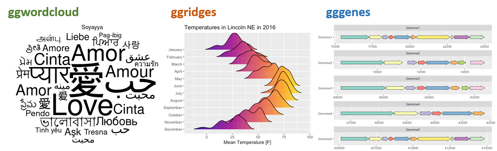
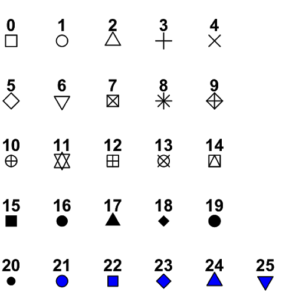

## **Introduction**

In the last class we looked at R through the lens of basic concepts all the way to presenting an introduction to data wrangling. The material for the current class focuses on communicating results using graphical methods. For this, we will use the `ggplot2` package. `ggplot2` is the most popular and robust package for data visualization. There are plenty of resources on two packages, but a good start is with the [package website](https://ggplot2.tidyverse.org/index.html) and a very useful [cheat sheet](https://www.rstudio.com/wp-content/uploads/2015/03/ggplot2-cheatsheet.pdf). Most of the popularity with `ggplot2` is because its quality and numerous types of plot that can render.

<br>

```{r,echo=FALSE, out.width='75%', fig.align='center', fig.cap='[Source](https://github.com/allisonhorst/stats-illustrations/blob/master/rstats-artwork/ggplot2_masterpiece.png)'}
knitr::include_graphics("figures/intro_r/ggplot2_masterpiece.png")
```

How is `ggplot2` structured? This packaged was inspired by the book [The Grammar of Graphics](https://www.amazon.com/Grammar-Graphics-Statistics-Computing/dp/0387245448), by Leland Wilkinson. Specifically, the strength with `ggplot2` is a function of building a graphic by breaking down the plot in different parts, which allows the end-user the flexibility to build the graphic to their desired liking and goal.

The most important components of ggplot2 graphs are:

-   Geometric Elements
-   Aesthetics
-   Scales
-   Facet
-   Labels
-   Themes

In the next sections, we will explore these different components in more detail. Each section will add one more component to our base graph. It is important to mention that we will not cover all the different types of plots that you can do it with `ggplot2`, first because there are many different types, and second, because extensions for new types of graphics are created frequently. This lesson should "arm" you with an excellent introduction to be able to explore other graphical tools available in this package and R in general.

## **Hands on**

First, lets start with the data the we used last class.

```{r}
data_demo <- readr::read_csv("data/intro_r/data_demo.csv")
data_demo
```

<br>

Every `ggplot2` plot starts with the function, `ggplot()`.

```{r message=FALSE, warning=FALSE}
library(tidyverse) # load ggplot2 and other tidyverse package

ggplot()
```

<br>

Note: when you do not inform `ggplot2` of what data you want plot, the function `ggplot()` will only print a gray panel.

This is where *data* and *aesthetics* enter the discussion.

```{r}
ggplot(data = data_demo, aes(x = trt, y = yld)) # aes is short for aesthetics
```

<br>

So far, we have only told `ggplot` that our graphic will have information about treatments values in the x-axis and the variable yield on the y-axis. However, there are plenty of plots that could be created with quantitative and qualitative variables, for example, boxplots or line plots.

At this point, what we will do in the next steps is to indicate to R exactly what type of plot we want to create. This is where information about the *geometric elements* are considered.

## **Geometric elements**

### **`ggplot2` native `geom_*()`**

In this step, we now indicate to R the specific type of graphic we are going to create, for example, line, points, histogram, etc.

Below is an example plotting the points (or raw data) using `geom_point()`.

```{r}

ggplot(data = data_demo, aes(x = trt, y = yld)) + # Note: we use the "+" sign to connect lines of code 
  geom_point()

```

<br>

Because many of the points overlap, a better option for this plot will be the `geom_jitter()`, which adds a small amount of random variation to the location of each data observation.

```{r}

ggplot(data = data_demo, aes(x = trt, y = yld)) +
  geom_jitter()

```

<br>

What occurred is that each observation is dispersed horizontally by the differing amounts of random variation, with the goal to avoid overlapping observations. Nonetheless, given the amount of variation, the observations appear too disperses, making it difficult to clearly see where one treatments ends and where the other one starts. We can modify the `geom_jitter()` function to reduce the amount of dispersion by using the argument `width` inside the function (see below). (Note: all `geom_*` functions additional arguments which can be added, depending on the need.)

```{r}

ggplot(data = data_demo, aes(x = trt, y = yld)) + 
  geom_jitter(width = .2) # the default value is 0.4, we reduce the dispersion by half

```

<br>

While points provide a good idea of the dispersion in a dataset, they are not the only way to represent the data. We will illustrate in the next set of code some of the different ways to explore the data:

**Boxplot** (`geom_boxplot()`)

```{r}

ggplot(data = data_demo, aes(x = trt, y = yld)) + 
  geom_boxplot() 

```

<br>

**Violin plot** (`geom_violin()`)

```{r}

ggplot(data = data_demo, aes(x = trt, y = yld)) + 
  geom_violin() 

```

<br>

**Dot plot** (`geom_dotplot()`)

```{r}

ggplot(data = data_demo, aes(x = trt, y = yld)) + 
  geom_dotplot(binaxis = "y", stackdir = "center") 

```

<br>

Another way to think about `geom_*` functions is to consider these as `layers`. We can begin to stack different options to improve the quality of the plot, as well as provide more information about the data itself, the dispersion, and start to compare different factors of interest.

```{r}
# Boxplot and points

ggplot(data = data_demo, aes(x = trt, y = yld)) +
  geom_boxplot()+ 
  geom_jitter(width = .2, size = 4) 

```

<br>

While there is no limit to the number of layers (geom\_\*) that you can use in a plot, remember that these all map to the same order that they appear and it may make it more difficult to make clear comparisons.

```{r}
# Multiple layers 

ggplot(data = data_demo, aes(x = trt, y = yld)) +
  geom_boxplot()+ 
  geom_jitter(width = .2, size = 4)+
  geom_violin() # Note that the violin plot is the last layer to be add, therefore it will overlap with the other layers

```

<br>

One way to overcome one graphic reducing the ability to make a clear interpretation is to change the order of the layers.

```{r}
# Multiple layers 

ggplot(data = data_demo, aes(x = trt, y = yld)) +
  geom_violin()+
  geom_boxplot(width = 0.3)+ # using the argument width we can adjust the box size
  geom_jitter(width = .2, size = 4)
  
```

<br>

There are plenty of other native `geom_*` functions in `ggplot2`. Below you can see other examples extracted from the `ggplot2` cheatsheet from RStudio ([Download eng](https://github.com/rstudio/cheatsheets/raw/master/data-visualization-2.1.pdf) or [Download sp](https://github.com/rstudio/cheatsheets/raw/master/translations/spanish/ggplot2.pdf))

```{r,echo=FALSE, out.width='100%', fig.align='center', fig.cap='Examples of `geom_*` functions'}

```

<br>

### **Extension packages**

There are also extension packages that expand the geometric elements and other functions from `ggplot2`. You can check a gallery of different extension following this [link](https://exts.ggplot2.tidyverse.org/gallery/), and few examples below.

```{r,echo=FALSE, out.width='100%', fig.align='center', fig.cap='Examples of packages that works as extension for `ggplot2`. From left to right `ggwordcloud`, `ggridges`, and `gggenes`'}

```

## **Aesthetics**

The next component in `ggplot2` plots is aesthetics, which is how our observations will be mapped in the plot. Aesthetics can have multiple formats. So far, we have used aesthetics regarding the positions `x` and `y` in the `aes()` argument. However, there are many other formats that aesthetics can take, and the most common are:

-   Position: x and y-axis
-   Color; fill; and alpha
-   Shape
-   Size
-   Linetype

### **Color**, **fill**, and **alpha**

<br> These three aesthetics have some similarities. `color` refers to the color of point or lines, `fill` refers to the color for an enclosed space (box, polygon, circle, etc), and `alpha` refers to the color transparency.

In the the plot below we use the `color` aesthetic to differentiate the treatments.

```{r}

ggplot(data = data_demo, aes(x = trt, y = yld, color = trt)) +
  geom_boxplot()+ 
  geom_jitter(width = 0.2, size = 4)
  
```

<br>

If we want to use `color` only for the points, we remove the argument `color` argument from the `ggplot()` function, and write the argument inside the `geom_jitter()`

```{r}

ggplot(data = data_demo, aes(x = trt, y = yld)) +
  geom_boxplot()+ 
  geom_jitter(aes(color = trt), width = 0.2, size = 4) # different colors for each observation/point depending on the treatment
  
```

<br>

Or, we can use different fill colors in the respective boxplots

```{r}

ggplot(data = data_demo, aes(x = trt, y = yld)) +
  geom_boxplot(aes(fill = trt))+
  geom_jitter(width = 0.2, size = 4)
  
```

<br>

Lastly, here is an example using `alpha` to define the transparency in the yield.

```{r}

ggplot(data = data_demo, aes(x = trt, y = yld)) +
  geom_boxplot()+
  geom_jitter(aes(alpha = yld), # Here we are using alpha to show a yield gradient 
              width = 0.2, size = 4) # increase the point size to see the differences better 
  
```

<br>

If we use these arguments (color, fill, and alpha) outside of the aesthetic function, they change the whole element.

```{r}

ggplot(data = data_demo, aes(x = trt, y = yld)) +
  geom_violin(color = "red")+ # border color equal to red
  geom_boxplot(width = 0.3, fill = "green")+ # fill equal to green
  geom_jitter(alpha = 0.4, # 60% of transparency
              width = 0.2, size = 4) 
  
```

### **Size**

The `size` aesthetic allows us to change the element size.

```{r}

ggplot(data = data_demo, aes(x = trt, y = yld)) +
  geom_boxplot()+ 
  geom_jitter(aes(size = sev), #The size of the point changes depending on the severity value
              width = 0.2)
  
```

### **Shape**

<br>

There is several options for the shape type in `ggplot`, with the most common present below.

```{r,echo=FALSE, out.width='50%', fig.align='center', fig.cap='Different shape options'}

```

```{r}

ggplot(data = data_demo, aes(x = trt, y = yld)) +
  geom_boxplot()+ 
  geom_jitter(aes(shape = trt), 
              width = 0.2, size = 4)
  
```

<br>

Note that shapes from 21 to 25 have color and fill, while the others only define the color.

```{r}

ggplot(data = data_demo, aes(x = trt, y = yld)) +
  geom_boxplot()+ 
  geom_jitter(aes(color = trt, # point border color
                  fill = var), # point fill defined by the variety 
              shape = 21, # we can change fill and color on shape 21 to 25
              stroke = 1.5, # to make point border thicker
              width = 0.2, size = 4)

# when we talk about scale we will learn how to chose the colors
# so far we are using default ggplot options  

```

### **Linetype**

We can also have different line types for each level of a variable. In the example below, we use two different `linetype` aesthetics to separate the varieties by their level of genetic resistance, where R is resistant and S is susceptible.

```{r}

# We use pipes to summarize the data by treatment and variety
data_line <- data_demo %>% 
  group_by(trt, var) %>% 
  summarise(sev = mean(sev))  
data_line

# Then we creat a plot with different line types
  ggplot(data_line) +
  geom_line(aes(x = trt,
                y = sev, 
                linetype = var, # each variety (R or S) will have a different line type
                group = var),   # group is telling R that it should group the data by variety
                size = 1)  # 


```

## **Scales**

So far we have built our plot using the default options, now we will start to customize it using `scales`. Scales control how the aesthetics are mapped, therefore, for each aesthetic we will have a respective `scale` function. Let's start by looking at the x and y aesthetics.

### **Position scales (x- y-axis)**

#### **`scale_*_continuous`**

X-axis, we can use `scale_y_continuous`. Y-axis, we can use `scale_x_continuous`.

```{r}

ggplot(data = data_demo, aes(x = trt, y = yld)) +
  geom_boxplot()+ 
  geom_jitter(aes(fill = trt), shape = 21, width = 0.2, size = 4, show.legend = FALSE)+
  
  scale_y_continuous( # because our y-axis variable is continuous
                  name = "Title of our axis", # name of the axis
                  limits = c(70, 130),    # here we increase a little our axis limits
                  breaks = c(seq(70,130,10))) # secondary axis breaks


```

<br>

We can add a second axis.

```{r}

ggplot(data = data_demo, aes(x = trt, y = yld)) +
  geom_boxplot()+ 
  geom_jitter(aes(fill = trt), shape = 21, width = 0.2, size = 4, show.legend = FALSE)+
  
  scale_y_continuous(name = "Yield (bu/ac)", 
                     limits = c(70, 130),
                     breaks = c(seq(70,130,10)),
                     
            # Here we add a second axis
            sec.axis = sec_axis( # if we only want to duplicate an axis, we can use sec.axis = dup_axis())
                                trans = ~ . *0.0672, # we use a transformation to change yield from  bu/ac to ton/ha
                                name =  "Yield (ton/ha)", # secondary axis name
                                breaks = c(seq(4.5,9,0.5)))) # secondary axis breaks

```

<br>

*NOTE*: the second axis works for discrete axis as well (see next subsection)

#### **`scale_*_discrete`**

We will use the x-axis to illustrate. With scale\_\*\_discrete you can do things like rearrange or select/excluse levels.

```{r}

ggplot(data = data_demo, aes(x = trt, y = yld)) +
  geom_boxplot()+ 
  geom_jitter(aes(fill = trt), shape = 21, width = 0.2, size = 4, show.legend = FALSE)+
  
  scale_x_discrete( 
              limits = c("B", "A", "D")) # here we change the order of treatments and exclude the treatment C
   
```

*NOTE*: R give an warning message informing that there are missing values. This is because our selection made by argument `limits` transformed all values of `trt = C` into missing values, `NA`s.

<br>

We can also change the labels using the `labels` argument.

```{r}

ggplot(data = data_demo, aes(x = trt, y = yld)) +
  geom_boxplot()+ 
  geom_jitter(aes(fill = trt), shape = 21, width = 0.2, size = 4, show.legend = FALSE)+
  
  scale_x_discrete( 
            labels = c('B' = 'New Label', # pProvide to ggplot new label information for each variable
                       'D' = 'New Label \n in two lines')) # you can use the "\n" to break the sentence in more lines


```

### **Color and fill scales**

`color` and `fill` are two aesthetics that are very similar. To avoid redundancy, we will use examples based on `fill` only, but the same principles apply to the color aesthetic. To change colors in R, we can use built-in names or the RGB code. There are 657 built-in color names in R. You can see their names by using the function `color()` and the figure below provides a few examples.

The RBG code is the additive combination of **R**ed, **G**reen, and **B**lue in an hexadecimal format, which can take 16 possible "values" (0, 1, 2, 3, 4, 5, 6, 7, 8, 9, A, B, C, D, E, F) which are in 6-character arrangements. There are also two extra characters which define the color transparency.

```{r,echo=FALSE, out.width='75%', fig.align='center', fig.cap='Colors with the name build-in in R (left and center) and RGB scheme'}
knitr::include_graphics("figures/intro_r/color.png")
```

#### **`scale_fill_manual()`**

```{r}

ggplot(data = data_demo, aes(x = trt, y = yld)) +
  geom_boxplot()+ 
  geom_jitter(aes(fill = trt), 
              shape = 21, width = 0.2, size = 4)+
  scale_fill_manual(values = c("blue", # color name
                               "gray67", # color name, but from a different gray intensity
                               "#9f3b6c", # use RGB code to assign a color
                               "#9f3b6c80")) # same color as trt C, but with transparency
```

<br>

Although selecting a color for a plot seems trivial, it is actually very challenging. There are many things to consider when we use a color scheme (pallet). We need to consider if the person is color blind or if they follow good practices for data visualization. While we will not specifically discuss these topics during the course, we highly recommend that you look for more information on these topics.

There are plenty of resources to chose color, of which one of the most popular is the website [colorbrewer2.org](colorbrewer2.org), conceptualized by professor [Dr. Cynthia A. Brewer](https://sites.psu.edu/cbrewer/). In this website there are suggestions of pallets for sequential, diverging, and qualitative data, as well as useful information regarding color blind and print friendly options.

<br>

```{r,echo=FALSE, out.width='100%', fig.align='center', fig.cap='Print screen of colorbrewer2.org website. 1 - number of classes; 2 - type of data; 3 - pallet option; 4 - name of pallet and information for color blind, photocopy, LCD, and  printer friendly options'}
knitr::include_graphics("figures/intro_r/brewer.png")
```

<br>

This website was so popular within `ggplot2` that it has become a package and now is native to ggplot2 through the function `scale_color/fill_brewer()`. An example using the pallet from the figure above can be seen in the next plot .

```{r}
ggplot(data = data_demo, aes(x = trt, y = yld)) +
  geom_boxplot()+ 
  geom_jitter(aes(fill = trt), 
              shape = 21, width = 0.2, size = 4)+
  scale_fill_brewer(palette = "Paired") # This scale automatic identify the number of classes and used the defined pallet to fill the colors

```

<br>

Interestingly, there are also developers who have created packages for color pallets, one example is the package [ggsci](https://cran.r-project.org/web/packages/ggsci/vignettes/ggsci.html), where the pallets were created using colors common to a select group of scientific journals.

```{r}

library(ggsci)

ggplot(data = data_demo, aes(x = trt, y = yld)) +
  geom_boxplot()+ 
  geom_jitter(aes(fill = trt), 
              shape = 21, width = 0.2, size = 4)+
  scale_fill_npg() # This scale automatically identifies the number of classes and uses the defined pallet to fill the colors

```

#### **`scale_fill_gradient*()`**

If our variable is quantitative, we can use a color fill based on a gradient. There are basically 3 different scales for gradient, `scale_fill_gradient()`, `scale_fill_gradient2()`, and `scale_fill_gradientn()`.

`scale_fill_gradient()`: create a gradient from two colors (low and high)

```{r}

ggplot(data = data_demo, aes(x = trt, y = yld)) +
  geom_boxplot()+ 
  geom_jitter(aes(fill = fdk), 
              shape = 21, width = 0.2, size = 4)+
  scale_fill_gradient(low = "green",
                      high = "red", 
                      na.value = "blue")


```

<br>

`scale_fill_gradient2()`: create a gradient from three colors (low, middle, and high)

```{r}

ggplot(data = data_demo, aes(x = trt, y = yld)) +
  geom_boxplot()+ 
  geom_jitter(aes(fill = fdk), 
              shape = 21, width = 0.2, size = 4)+
  
  scale_fill_gradient2(low = "blue", # This is the low value
                       mid = "yellow", # middle value
                       high = "red",  # high value
                       midpoint = 21, # set up the middle point, otherwise will use the default "0"
                       na.value = "black") # we can also change the color of NAs values

# Note, ggplot2 distributes the color symmetric from the middle point, so, depending on where the middle point is, it is possible that low or high color values may not be reached. 

```

<br>

`scale_fill_gradientn()`: create a gradient from n colors

```{r}

ggplot(data = data_demo, aes(x = trt, y = yld)) +
  geom_boxplot()+ 
  geom_jitter(aes(fill = fdk), 
              shape = 21, width = 0.2, size = 4)+
  
  scale_fill_gradientn(colours = c("#FF0000", "#FFFF00", "#00FF00",
                                   "#00FFFF", "#0000FF", "#FF00FF")) 

```

### **Alpha and size scales**

Alpha and size are two scales that are generally used for quantitative variables.

#### **`scale_alpha_*`**

`scale_alpha_continuous()`: plot the variables in a range of transparency. By default, this range is from 0.1 to 1.0

```{r}
# Without specifying the scale, R will assume the default values
# therefore, here we would have the same results as if we have
# scale_alpha_continuous(range = c(0.1,1))


ggplot(data = data_demo, aes(x = trt, y = yld)) +
  geom_boxplot()+ 
  geom_jitter(aes(alpha = fdk), 
              width = 0.2, size = 4)
```

<br>

We can change the range by using the argument `range`

```{r}

ggplot(data = data_demo, aes(x = trt, y = yld)) +
  geom_boxplot()+ 
  geom_jitter(aes(alpha = fdk), 
              width = 0.2, size = 4)+
  
  scale_alpha_continuous(range = c(0.3, 0.6)) 

```

<br>

Note that there are two observations in treatment A where the color transparency did not change. These two observations represent points without values for FDK (`NA`s). We can work on some strategies to deal with this problem.

First, remove those two points from the whole data set. This will however result in another problem, since the calculations used to create boxplots considers those observations.

A better option is to use a different color or shape for those observations, which will require some work in our code. In the function `scale_alpha_continuous` there is the argument `na.value`, where we will assign values of `alpha` to `NA` observations. We can make `NA`s observations disappear by attributing`na.value = 0`. We then plot those two observations using another layer (`geom_jitter`), where we could use shape or color to differentiate those observations. In our example, we use shape.

```{r}

ggplot(data = data_demo, aes(x = trt, y = yld)) +
  geom_boxplot()+ 
  geom_jitter(aes(alpha = fdk), 
              width = 0.2, size = 4)+
  
  geom_jitter(data = filter(data_demo, is.na(fdk)), # filter the data such that there are only the two obs with NA values
              aes(x = trt, y = yld), # position
              shape = 8, # we will define a very different shape for NA
              width = 0.2, height = 0, size = 4)+ 
  
  scale_alpha_continuous(range = c(0.4, 1), # our alphas will change from 0.4 to 1
                         na.value = 0)  # Make NAs values completely transparent
```

<br>

This is an example of how we can use the layer design of `ggplot2` and some creativity to overcome a potential problem. Each scale can have a way to assign values for `NA`s, which is very convenient to other `scale` functions, such as color or shape. However, with `scale_alpha_continuous`, changing the transparency for `NA`s does not make them disappear, so we need to specifically define the `NA`s transparency (`na.value = 0`) and add a new layer *only* for those two points. This same principle can be applied for other situations, such as wanting to emphasize a particular point in a database, etc.

<br>

#### **`scale_size_*`**

Size is similar to alpha scale.

```{r}

ggplot(data = data_demo, aes(x = trt, y = yld)) +
  geom_boxplot()+ 
  geom_jitter(aes(size = fdk), 
              width = 0.2)+
  
  scale_size_continuous(range = c(1, 6)) # this is actually the default value 
                                       
```

Note that `ggplot` provides us with a warning message indicate that two values were removed. This is different to how `scale_alpha_continuous` handled the same issue. We emphasize that it is important to understand how ggplot will deal with `NA`s. Similar to the previous example, we will add an extra layer to add these `NA`s. We also will change the order, making values with lower FDK bigger, by adding the argument `trans = "reverse"`.

```{r}

ggplot(data = data_demo, aes(x = trt, y = yld)) +
  geom_boxplot() + 
  geom_jitter(aes(size = fdk), 
              width = 0.2) + 
  
  # same as previous example to deal with the NA problem
  # warning will continue to show up, but the NAs are now added
  geom_jitter(data = filter(data_demo, is.na(fdk)), 
              aes(x = trt, y = yld), 
              shape = 8, 
              width = 0.2, height = 0, size = 4) + 
  
  scale_size_continuous(range = c(0.5, 5), 
                        trans = "reverse")  # this reverses the size argument, meaning small values have a larger size
                                       
```

### **Shape and linetype scales**

#### **`scale_shape_manual`**

The shape option is very limited in terms of customization.

```{r}

ggplot(data = data_demo, aes(x = trt, y = yld)) +
  geom_boxplot()+ 
  geom_jitter(aes(shape = var), # We will use the factor, variety, to define the different shapes
              width = 0.2, size = 4)+
  
  scale_shape_manual(values = c(8, 15)) # Here we defined two different shapes depending on the variety
```

#### **`scale_linetype_manual`**

There are a few options for linetype that we can use.

```{r}
# preparing the data for our plot
line_yld = data_demo %>% 
  group_by(trt, var) %>% 
  summarize(yld = mean(yld))

line_yld

  ggplot(line_yld) +
  geom_line(aes(x = trt,
                y = yld, 
                linetype = var, # each variety (R or S) will have a different line type
                group = var),   
                size = 1) 

```

R has a few options for lines. These can selected by their name, or by the number defined by `scale_linetype_manual`.

```{r echo=FALSE}

line_d <-  data.frame(
  linetype = factor(1:6,
    labels = c("solid", "dashed", "dashed", "dotdash", "longdash", "twodash"))) 

ggplot(line_d) +
  geom_hline(aes(linetype = linetype, yintercept = 0), size = 2) +
  scale_linetype_identity() +
  facet_grid(linetype ~ .) +
  theme_void(20)

```

<br>

Illustrated using the linetype for varieity and the options "twodash" or "dashed".

```{r echo=FALSE}
  ggplot(line_yld) +
  geom_line(aes(x = trt, y = yld, 
                linetype = var, 
                group = var),   
                size = 1) +
  
  scale_linetype_manual(values = c("twodash", "dashed"))

```

## **Facets**

Facets allow us to create multiple plots based on specified variable. In our previous examples, we used things like shape to differentiate some of the variables, for example, variety. Now, we will create separate plots for the variety, but within the same graphic. To accomplish this, we apply the option `facet_*`, of which there are two types of facet in `ggplot2`, `facet_wrap` and `facet_grid.`

### **Facet wrap**

```{r}
ggplot(data = data_demo, aes(x = trt, y = yld)) +
  geom_boxplot()+ 
  geom_jitter(aes(fill = trt), shape = 21, width = 0.2, size = 4)+
  scale_fill_npg() +
  
  facet_wrap(~var)

```

<br>

What occurred? Our original plot was now split in two with one for the resistant variety (R) and the other for the susceptible (S) variety. The configurations for the two plots are similar, as are the scales, meaning that they provide standardized information and can be compared, etc.

One thing to note though is that the data used to create this plot is different from when we had the two variables combined. As result, `ggplot2` considered that some of our observations are outliers, when before we did not have this issue. This is a good example which illustrates that when we change the database structure, we need to make sure that we verify the outputted result to check for problems. In this example, we need to an options to suppress the outlier in the `geom_boxplot`.

```{r}
ggplot(data = data_demo, aes(x = trt, y = yld)) +
  geom_boxplot(outlier.alpha = 0)+ # we define the outliers as completely transparent

  # Note: By making these outliers observations transparent, they are still considered in the calucations for boxplots,
  # at same time, they are not duplicated in the plot with the geom_jitter
  
  geom_jitter(aes(fill = trt), shape = 21, width = 0.2, size = 4)+
  scale_fill_npg() +
  
  facet_wrap(~var)


```

Below we can see an example of how to change the y-axis scale and the strip text (text above each plot)

```{r}
ggplot(data = data_demo, aes(x = trt, y = yld)) +
  geom_boxplot(outlier.alpha = 0)+ #outliers defined to be completely transparent
  geom_jitter(aes(fill = trt), shape = 21, width = 0.2, size = 4)+
  scale_fill_npg() +
  
  facet_wrap(~var, 
             scales = "free_y", # scales will be independent if free, or only one dimension if free_y/x
             labeller = labeller( # here is an example of how to change the 
                      var = c("R" = "Resistant", # need to remember the order of the call to define the variables
                              "S" = "Susceptible"))) # then give a new name for each level


```

<br>

Below, we can see an example of how to change the y-axis scale and output the graph in a stacked format with labels (text above each plot)

```{r, fig.height = 7}
ggplot(data = data_demo, aes(x = trt, y = yld)) +
  geom_boxplot(outlier.alpha = 0)+ # outliers are defined to be completely transparent
  geom_jitter(aes(fill = trt), shape = 21, width = 0.2, size = 4)+
  scale_fill_npg() +
  
  facet_wrap(~var, labeller = labeller(var = c("R" = "Resistant", "S" = "Susceptible")), 
             ncol = 1, nrow = 2) # this defines how the graphics are displayed

```

### **Facet grid**

`facet_grid`" create a grid of plots, using one variable to define the columns and the other to define the rows. In the example below we split the incidence between "low" (inc $\leq$ 10%) and high (inc $\ge$ 10%) using `mutate` and logical operators.

```{r}

data_grid <- data_demo %>% 
    # create a new variable by splitting the incidence using a 10% threshold
    mutate(inc_cat = if_else(inc <=10, "Low Incidence", "High Incidence"))
  
ggplot(data = data_grid, aes(x = trt, y = yld)) +
  geom_boxplot(outlier.alpha = 0)+ 
  geom_jitter(aes(fill = trt), shape = 21, width = 0.2, size = 4)+
  scale_fill_npg() +
  facet_grid(inc_cat~var, # inc_cat = row; var=column
             labeller = labeller(var = c("R" = "Resistant", "S" = "Susceptible")))

```

We can use grid with only one variable as well.

```{r}
ggplot(data = data_demo, aes(x = trt, y = yld)) +
  geom_boxplot(outlier.alpha = 0)+
  geom_jitter(aes(fill = trt), shape = 21, width = 0.2, size = 4)+
  scale_fill_npg() +
  facet_grid(.~var) # grid by column
  


ggplot(data = data_demo, aes(x = trt, y = yld)) +
  geom_boxplot(outlier.alpha = 0)+ # outliers defined to be completely transparent
  geom_jitter(aes(fill = trt), shape = 21, width = 0.2, size = 4)+
  scale_fill_npg() +
  facet_grid(var~.) # grid by row
```

## **Labels**

Below we have an example of how to change the y-axis scale and text options

```{r}
ggplot(data = data_demo, aes(x = trt, y = yld)) +
  geom_boxplot(outlier.alpha = 0)+ 
  geom_jitter(aes(fill = trt), shape = 21, width = 0.2, size = 4)+
  scale_fill_npg() +
  
  labs(
    # labels for the plots in general
    title = "Here is a title",
    subtitle = "Here is the plot subtitle",
    caption = "This is figure caption",
    tag = "A", 
    
    # Labels for the aesthetics 
    y = "y-axis title",
    x = "x-axis title",
    fill = "fill title"
    
  )

```

## **Themes**

So far, we built our plots focusing on how to work and under the data being plotted by using layers (`geom`), aesthetics, and facets. Now we will take a quick look on how to change some of non-data components of the plot. We can make many of these changes using `theme()`.

`ggplot2` has complete themes and options to customize those. There are also several packages that have extra complete themes.

### **Complete themes**

`ggplot2` has ten built-in themes that are very convenient to use.

#### **Built-in themes\`**

**`theme_bw`**: dark-on-light, works well with presentations displayed with a projector.

```{r}
ggplot(data = data_demo, aes(x = trt, y = yld)) +
  geom_boxplot(outlier.alpha = 0) + 
  geom_jitter(aes(fill = trt), shape = 21, width = 0.2, size = 4) +
  scale_fill_npg() +
  labs(y = "Yield (bu/ac)", x = "Treatments", fill = "Treatments") +
  # only enter with the theme name
   theme_bw() # theme black and white

```

**`theme_minimal`**: no background annotations

```{r}
ggplot(data = data_demo, aes(x = trt, y = yld)) +
  geom_boxplot(outlier.alpha = 0)+ 
  geom_jitter(aes(fill = trt), shape = 21, width = 0.2, size = 4)+
  scale_fill_npg() +
  labs(y = "Yield (bu/ac)", x = "Treatments", fill = "Treatments")+
  # only enter with the theme name
   theme_minimal() 

```

**`theme_classic`**: classic design, x and y axis lines, but no gridlines

```{r}
ggplot(data = data_demo, aes(x = trt, y = yld)) +
  geom_boxplot(outlier.alpha = 0)+ 
  geom_jitter(aes(fill = trt), shape = 21, width = 0.2, size = 4)+
  scale_fill_npg() +
  labs(y = "Yield (bu/ac)", x = "Treatments", fill = "Treatments")+
  # only enter with the theme name
  theme_classic() 

```

<br>

Other complete themes in `ggplot2` include: `theme_grey()` (default); `theme_linedraw()`; `theme_light()`; `theme_dark()`; `theme_void()`; `theme_test()`

#### **From other packages**

There is several package with built-in themes, here we will use only two as examples.

**ggthemes package**

[`ggthemes` package](https://yutannihilation.github.io/allYourFigureAreBelongToUs/ggthemes/) - Has several different complete themes. The example below (`theme_economist()`) is inspired by plots made by the magazine "The Economist".

```{r}
library(ggthemes)

ggplot(data = data_demo, aes(x = trt, y = yld)) +
  geom_boxplot(outlier.alpha = 0)+ 
  geom_jitter(aes(fill = trt), shape = 21, width = 0.2, size = 4)+
  scale_fill_npg() +
  labs(y = "Yield (bu/ac)", x = "Treatments", fill = "Treatments")+
  # only enter with the theme name
  theme_economist()

```

**bbplot package**

[bbplot](https://github.com/bbc/bbplot/) is a package developed by the BBC team.

```{r}
# This package is not yet in the CRAN, so we need to download from a website called GitHub
# to do this, we need the package 'devtools', if you don't have it, make sure that you run both lines

# install.packages('devtools')
# devtools::install_github('bbc/bbplot')


library(bbplot)


ggplot(data = data_demo, aes(x = trt, y = yld)) +
  geom_boxplot(outlier.alpha = 0)+ 
  geom_jitter(aes(fill = trt), shape = 21, width = 0.2, size = 4)+
  scale_fill_npg() +
  labs(y = "Yield (bu/ac)", x = "Treatments", fill = "Treatments")+
  # only enter with the theme name
  bbc_style()

```

### **Customized**

Another option is to not use the built-in themes and customize the plots ourselves. `ggplot2` has a [lot of options](https://ggplot2.tidyverse.org/reference/theme.html) for customization, from the legend position to the ticks size. As you can imagine, it would be difficult to cover each of these options, but we will illustrate a few examples.

Let's start with a plain plot where we modify a few elements, such as the legend, strip text, axis text and title

```{r}

# This is the default theme

ggplot(data = data_demo, aes(x = trt, y = yld)) +
  geom_boxplot(outlier.alpha = 0)+ 
  geom_jitter(aes(fill = trt), shape = 21, width = 0.2, size = 4)+
  scale_fill_npg() +
  
  facet_grid(~var, labeller = labeller(var = c("R" = "Resistant", "S" = "Susceptible")))+
  
  labs(y = "Yield (bu/ac)", x = "Treatments", fill = "Treatments") +
  
  theme(
    # theme function is empty, so will plot the default theme
  )

```

```{r}

# This is the default theme

ggplot(data = data_demo, aes(x = trt, y = yld)) +
  geom_boxplot(outlier.alpha = 0)+ 
  geom_jitter(aes(fill = trt), shape = 21, width = 0.2, size = 4)+
  scale_fill_npg() +
  
  facet_grid(~var, labeller = labeller(var = c("R" = "Resistant", "S" = "Susceptible")))+
  
  labs(y = "Yield (bu/ac)", fill = "Treatments", 
       x = NULL) + # we suppress the x-axis title, since it will be in the legend
  
   theme(
     # change the background color to white
      panel.background = element_blank() , 
    
     # the default color is white, so we have to change to gray to be different from the background
      panel.grid.major = element_line(colour = "grey88"), 
     
     # the default theme does not have a border
       panel.border = element_rect(colour = "grey80", fill = NA),
    
    # axis text to black (was a little gray)
    axis.text.y  = element_text(colour = "black"),
    #suppress the x-axis text, since it will be in the legend
    axis.text.x  = element_blank(),
    
    # Change titles (y-axis and legend[fill]) to black text, size 12, and bold
    title = element_text(colour = "black", size = 12, face = "bold"),

    # bring the legend to inside of the plot
    legend.position = c(0.90, .20),
    # Legend key was gray, change to white
    legend.key = element_rect(fill = "white"),
    # Legend text attribute
    legend.text = element_text(colour = "black", size = 12),
    
    # Strip text justified almost completely to the left - (hjust = 0.01)
    # hjust = 0.5 is center justification, and hjust = 1 is right justification
    strip.text.x =  element_text(hjust =0.01, face = "bold", size = 14),
    
    # strip text background 
    strip.background =  element_blank())

```

## **Combine plots**

Frequently, we need to combine multiple plots into a single one. While many people copy and paste their plots in a MS Power Point (or similar software) and save as new plot, this approach is very inefficient, compromises quality, and may cause unintentional errors.

A better approach is combine these plots in single one and save. There are a few good packages that can help with this task, including, [`gridExtra`](https://cran.r-project.org/web/packages/gridExtra/index.html), [`cowplot`](https://wilkelab.org/cowplot/index.html), and [`ggpubr`](https://rpkgs.datanovia.com/ggpubr/index.html), but we will explore a new package, and arguably easier one, called [`patchwork`](https://patchwork.data-imaginist.com/).

First, let's build some plots to be combined using `patchwork`. We will build four plots, considering the effect of treatment on the following variables: yield, severity, incidence, and FDK.

```{r}

# plots not display to save space (will be in the combined plot)

plot_yield <- 
ggplot(data = data_demo, aes(x = trt, y = yld)) +
  geom_boxplot(outlier.alpha = 0)+ 
  geom_jitter(aes(fill = trt), shape = 21, width = 0.2, size = 4)+
  scale_fill_npg() +
  labs(y = "Yield (bu/ac)", x = NULL)+
  theme(
      axis.text  = element_text(colour = "black"),
      title = element_text(colour = "black", size = 12, face = "bold"),
      legend.position = "none")

plot_sev <- 
ggplot(data = data_demo, aes(x = trt, y = sev)) +
  geom_boxplot(outlier.alpha = 0)+ 
  geom_jitter(aes(fill = trt), shape = 21, width = 0.2, size = 4)+
  scale_fill_npg() +
  labs(y = "Severity (%)", x = NULL)+
  theme(
      axis.text  = element_text(colour = "black"),
      title = element_text(colour = "black", size = 12, face = "bold"),
      legend.position = "none")

plot_inc <- 
ggplot(data = data_demo, aes(x = trt, y = inc)) +
  geom_boxplot(outlier.alpha = 0)+ 
  geom_jitter(aes(fill = trt), shape = 21, width = 0.2, size = 4)+
  scale_fill_npg() +
  labs(y = "Incidence (%)", x = NULL)+
  theme(
      axis.text  = element_text(colour = "black"),
      title = element_text(colour = "black", size = 12, face = "bold"),
      legend.position = "none")

plot_fdk <- 
ggplot(data = data_demo, aes(x = trt, y = fdk)) +
  geom_boxplot(outlier.alpha = 0)+ 
  geom_jitter(aes(fill = trt), shape = 21, width = 0.2, size = 4)+
  scale_fill_npg() +
  labs(y = "FDK (%)", x = NULL)+
  theme(
      axis.text  = element_text(colour = "black"),
      title = element_text(colour = "black", size = 12, face = "bold"),
      legend.position = "none")

```

```{r, fig.width=8}
library(patchwork)

# just use the "+" signal to combine the plots
plot_yield+plot_sev
```

```{r, fig.height=8}

# or the "/" to put one on top of the other
plot_yield/plot_sev

```

```{r fig.height=8, fig.width=8}
# use "()" to create a hierarchical order of combinations
(plot_yield+plot_sev) / # first combine yield and severity, followed by stacking incidence and fdk 
(plot_inc + plot_fdk)
```

<br>

And, we can add tags and make changes to the plot's overall theme

```{r fig.height=8, fig.width=8}
# use "()" to create a hierarchical order of combinations
(plot_yield+plot_sev) / # first combine yield and severity, followed by stacking incidence and fdk
(plot_inc + plot_fdk) +
  
  # add a tag for each plot, there way to customize this
    plot_annotation(tag_levels = "A")  & # very important, use "&" to make theme changes
  theme(
    axis.text.x  = element_text(colour = "red")) # red to make an obvious change
  
```

## **Saving plots**

We can use the the function `ggsave` to save a plot.

```{r eval=FALSE}

ggsave(plot = plot_yield, # name of the plot in R
       filename = "figures/intro_r/example1.png", # plot will be saved in the folder figures, with name example1, format png
       width = 85, height = 80, units = "mm", # plot dimension
       dpi = 450 ) # resolution

```

<br>

And below is how our *saved* plot looks (it is the upload version of the plot)

```{r,echo=FALSE, out.width='100%', fig.align='center', fig.cap='Plot saved in the computer and upload to this document'}

```

<br>

Note how the "saved plot" is different from the one printed in R. This is because we force our "saved plot" to have a specific dimension, which may be different than the dimension which our screen has. When this happens, if necessary, make the appropriated changes (change point size, text size, etc)

```{r}
plot_yield
```
