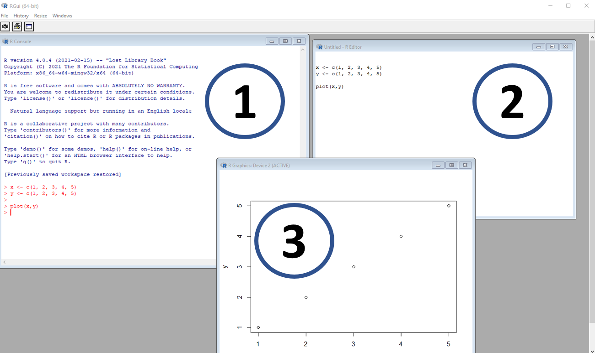
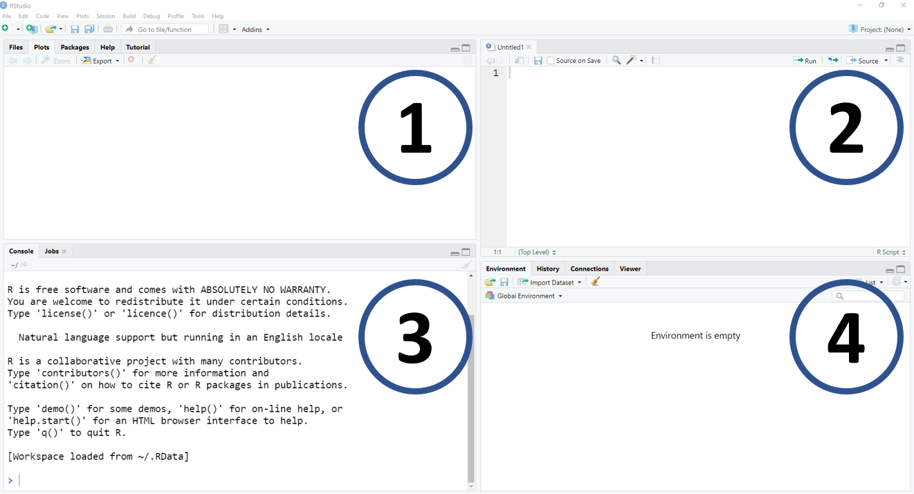

# **Introduction**

R is an open source language that was developed by Ross Ihaka and Robert Gentleman, using the S language as inspiration [(source)](https://www.r-project.org/about.html). Today R is one of the most popular tools used in data analysis and statistics.

This class will cover a basic introduction to R. Our goals are to prepare you for the next steps in the class. Please note that additional tools and functions will also be introduced as the course progress.

There are plenty of free, online resources available. Below are a few recommendations:

-   [R for Data Science](https://r4ds.had.co.nz/) by Garrett Grolemund and Hadley Wickham
-   [Advance R](https://adv-r.hadley.nz/) by Hadley Wickham
-   [RStudio Cheatsheets](https://www.rstudio.com/resources/cheatsheets/) by RStudio
-   [Intro to R](https://everhartlab.github.io/APS_IntroR_2020/refs.html) by Dr. Sydney E. Everhart, Nikita Gambhir, Dr. Kaitlin Gold, Dr. Lucky Mehra, and Dr. Zhian N. Kamvar.
-   [Modeling tools and techniques using R](https://rtools.netlify.app/) by Paul Esker and Felipe Dalla Lana

<br>

> **Remember**, R is a software language, and as such, it requires time and practice to master what the language offers. Similar to learning a new language, once you have learned some of the basics, you will be able to continuing adding new "words" to your vocabulary and continue to build a mastery of R.

# **R and RStudio**

**R** is free available to download [here](https://www.r-project.org/). R is supported by Windows, Linux, and Mac.

```{r,echo=FALSE, out.width='90%', fig.align='center', fig.cap='Figure, R. (1) is the console, where codes are entered and read by the software; (2) is the script or code source, where the user enters information that can be copied and pasted into the console; and (3) is a window with graph output'}

```

<br>

RStudio is the most popular IDE (Integrated development environment) used by R. It is simply a more user friendly software that integrates and runs R. It is developed by [RStudio](https://www.rstudio.com/), the same location where you can download the software. The software is highly customized and includes lotos of additional "plugins".

```{r,echo=FALSE, out.width='90%', fig.align='center', fig.cap='Figure, IDE-RStudio. (1) is a window with multiple pieces of information, for example, files, plots, packages, and help tools; (2) is the location of the source or script; (3) is the R console; (4) is a window with  objects, coding history and more'}

```

# **The basic**

R can be used as a simpler calculator:

```{r echo=TRUE}
# Addition
2+2

# Subtraction
10-5

# Multiplication
15*2

# Division
20/10

# Exponents
3^3 # or 3**3

# Modulos (values that remains from the division)
10%%3

# Integer division (fractional part is discarded)
10%/%3

```

<br>

And there are many more calculations with a function like style:

```{r}
# Mean
mean(c(4,10))

# Standard deviation
sd(c(2,2,4,4,2,2))

# Square root
sqrt(9)

# Natural log
log(100)

# Using log and defining the base (here base of 10)
log(100, base = 10)

# Exp
exp(5)

# Absolute value (not actually a calculation)
abs(-7)
```

<br>

You can assign names to objects or values, such as numbers. To do this, use the `<-` or `=`, although the first is preferred since it does avoid errors in very [specific situations](https://stackoverflow.com/a/51564252/7711459).

```{r , error=TRUE}

# Using = to assign a value
a = 2 
a

# Or using <- to assign a value
b <- 10 
b

# Tip: Alt and - (Windows) or Option and - (Mac) are shortcut for "<-"

# You can use the assigned object to do calculations
c <- a+b
c

# An object can also be characters 
d <- "R is fun"
d

# Can contain multiple numbers
e <- c(1,2,3,4,5) # the c means concatenate 
e

# They can be grouped into a table (more on this later)
f <- data.frame(First = c(1,2,3,4,5),
                Second = c("A", "B", "C", "D", "E"))
f

```

<br>

Although you can give almost any name for an object in R, there are some words that **cannot** be used and others that should be *avoided.*

```{r , error=TRUE}

# You cannot use a number as object name
1 <- 2

# Some words are reserved for specifics functions and cannot be used
NA <- 200
NaN <- 150
TRUE <-100
FALSE <- 50
Inf <- 0

# Other keywords that cannot be used as object name include:
# "break", "else", "for", "if", "next", "repeat", "return", and "while"

# You also cannot use specific keyboard symbols, such as /, @, %, !, etc.
UCR/fito <- 100

UCR@fito <- 100

UCR%fito <- 100
```

<br>

Some other helpful suggestions: it is good practice to label your objects in a very intuitive manner, and follow similar pattern.

For example, if you have multiple objects, such as monthly temperature, it would be considered preferable to use something like:`temp_jan`, `temp_fev`, `temp_mar`, etc. These names are very intuitive, and follow the same pattern (variable, underline separation, month with 3 characters), and will likely be understood for someone with some familiarity of the data.

On the other hand, using names such as `var1`, `col1`, `Object 1`, make it very difficult for someone to understand the coding without additional information. Avoid changing the name separation (e.g.`temp_jan`, `temp.feb`) and take extra care with the use of capitalization (upper and lower case letters), since R is sensitive to this and this can often lead to errors in your code or difficulties in running specific analyses. For example, `temp_Jan`, `Temp_Feb`, while both work, adds an additional layer of coding complexity that is not necessary.

<br>

When possible, we also recommend to avoid giving names to objects that are used as functions (more about functions below).

```{r}
# mean() calculate the object mean
mean(c(1, 2, 3, 4, 5))

# if you gave a name for an object of "mean", it may create awkward situations
mean <- c(1, 2, 3, 4, 5)
mean(mean)


```

<br>

We can give name to plots (data visualization will be covered in the next section) and many other data formats (data frames, matrix, vector, list, etc)

```{r}
# We will learn how to do better plots later, just for example here
library(ggplot2)

#plot data
data_plot = data.frame(x=c(1,2,3,4,5,6), y=c(1,2,3,4,5,6))

#plot
plot_name = ggplot(data_plot, aes(x = x, y=y)) + geom_point() 

#print plot
plot_name


```

<br>

# **Data types and structure**

## **Types of data**

From a practical point of view, the four most important data types (or modes) are:

-   **Numeric** = values that can be specified at the decimal level, for example `1.2`, `3.141593`, `10.0`, and `-5.2`;
-   **Integer** = similar to numeric, but they cannot be defined at the decimal level. Examples of integer are `1`, `2`, `-4`, an `500`;
-   **Logical** = can only be defined as `TRUE` or `FALSE`, or `T` and `F` for short;
-   **Character** = words that are like elements that are surrounded by " or ', such as `"PA"`, `"Costa Rica"`, `"soybean"`. But, these can also refer to other numbers (`"1.2"`, `'10'`, `'-15'`), or logical values (`"TRUE"`, `"FALSE"`);
-   **Factor** = categorical variable that contains predefined elements. Factors have levels, which determine the order of its elements. See below for examples;
-   **Date** = elements in data format, they can be at day level (*date*) or date and time, including hours, minute, second, and sub-second elements (*POSIXct*). See below for examples;

*NOTE*: For practical purposes, we simplified these types of data as part of the introduction. In R, these are called atomic vectors. There are also two other types of atomic vectors which are rarely used and will not be mentioned here (`complex` and `raw`). If you would like to explore this in more detail, we recommend Chapter 3 and 13 of Wickham book, [Advanced R](https://adv-r.hadley.nz/vectors-chap.html).

### **Numeric**

```{r}
# Lets create an example
numeric_example <- c(1.2, 1.5, 3.14, 2.7182)

# You can directly ask if the results are numeric with the function is.numeric()
is.numeric(numeric_example)

# Or ask what is the class of the vector
class(numeric_example)


```

### **Integer**

```{r}

# Let's start by entering a vector of numbers
integer_example <- c(1,5,7,-4)
is.integer(integer_example)

# If is not integer, what is the class type?
class(integer_example) 

# When you information as numbers, R will assume that is numeric
# We have to inform R that that the values are integers by using the function as.integer()
integer_exemple <- as.integer(c(1,5,7,-4))
is.integer(integer_exemple)
class(integer_exemple) 

# Now, if you enter information that has decimals and force the result to be an integer,
# R will ignore the decimal information 
as.integer(c(3.1, 4.9, 5.499999, 9.99999))

# If you enter information as words (= class, character) and try to force this to be an integer
# R will return an error
as.integer(c("Sunday", "Monday", "Tuesday", "Wednesday"))

# Now, what enters when you enter numerical values in character format
number_character <- c("1", "2", "3")
class(number_character)

as.integer(number_character)
class(as.integer(number_character))

# This type of transformation is very useful for some data loading in R where the values can be considered as characters


```

<br>

### **Logical**

```{r}

# As mentioned earlier, logical values can be only be considered as TRUE or FALSE
logical_example <- c(TRUE, FALSE, T, F)
is.logical(logical_example)

# Logical operations are very important for situations where you want to check specific conditions,
# for example, if one number is greater than then other
5 > 10        # five is greater than 10?
"Sunday" == "Monday"  # Sunday is equal to Monday?
"Sunday" != "Tuesday" # Sunday is different to Tuesday?

# Here is an example where R implies that the character element "2" 
# should be numeric and gives the correct answer

1 < "2"


```

### **Character**

```{r , error=TRUE}

# Character values are basic word elements
character_example <- c("banana", 'epidemiology', "TRUE", "11", "Character can be more than a single word")
is.character(character_example)

# As you can see, they can be defined using either " or '
character_example

# But if you forget to include the ' or ", R will give you an error message, as R thinks that it is an object
character_example <- c("banana", epidemiology)

```

### **Factor**

```{r}

# Different from characters, factors are ordinal, meaning that they have a defined order or structure 
factor_example <- as.factor(c("red", 'blue', "green", "red", "red"))
class(factor_example)

# Note that now we have attributes (levels) with our values
factor_example

# A more useful function is factor(), 
# since, using this function you can define specifically the order and other attributes
factor_example2 <- factor(c("red", 'blue', "green", "red", "red"), levels = c("red", "blue", "green"))
factor_example2

# Note that the order of the levels changed given that we specified the level order
# R by default uses an alphabetical ordering

# You can also change the name of the elements by changing the level label
factor_example3 <- factor(c("red", 'blue', "green", "red", "red", "yellow"), 
                          levels = c("red", "blue", "green", "yellow"), 
                          labels = c("RED", "Blue", "green", "green"))
factor_example3

# What happened? While we added a new color, yellow, we called the label "green", which means
# we redefined what yellow means.  
```

### **Date**

```{r}

# The most common date format is POSIX* 

# POSIX -- describes the date and time, to the millisecond  
# it takes the date in character (string) format
as.POSIXct("2021-04-05 11:30:45")

# You can use different time zones and date formats,
# for example, we define where the date as day, month, and year, 
# but in the New Zealand time zone (NZL)

as.POSIXct("25/04-2021 14:30:45", 
           format = "%d/%m-%Y %H:%M:%OS", 
           tz = "NZ")

# Note that we used /(slash) instead of - (dash). This is only to demonstrate 
# that R can deal with date information using different descriptions, which can be 
# common to different weather data sources.
# Also, it is important to note that although we can use different formats, 
# R still will print information using the default on ISO 8601, which means
# "year-month-day  hour(24):minutes:seconds time zone"


# There are two functions which we can use: POSIXct and POSIXlt

ct <- as.POSIXct("2021-04-05 11:30:45")
lt <- as.POSIXlt("2021-04-05 11:30:45")

# both output look the same
ct
lt

# They are from similar classes
class(ct)
class(lt)

# But, they have internally different attributes, with POSIXlt having multiple components 
unclass(ct) # the big number is the total of seconds since 1970-01-01
unclass(lt)

# It is possible to extract specific information, for example, year, month, day, etc.
weekdays(ct)
months(lt)
quarters(ct)

# The other class is date

dt <- as.Date("2021-04-05 11:30:45")
dt

# As you can see, they are similar to POSIX* functions, however, they include only the specified information
class(dt)
 
```

## **Data structure**

Now that we understand the most important types of data, in the next section, we will learn how to group them so we can start to do different analyses. R is quite flexible in terms of grouping data. There are basically six different data structures in R:

-   **Scalar** = a one element vector. ex. `x <- 2`; `y <- "beans"`
-   **Vector** = a one-dimensional object with multiple scalars from the same type/mode (numeric, integer, logical, etc.)
-   **Matrix** = a two-dimensional object that contains multiple vectors from the same type/mode
-   **Array** = is similar to a matrix but is three-dimensional. Can only hold data from the same type.
-   **Data frame** = are two-dimensional structures , similar to matrix, but can hold vectors from different types of data
-   **List** = are the most complex data structure in R, and can hold a collection of objects, ranging from something as simple as a one element scale to arraya, or plots.

The figure below illustrates the differences between these five data structure types"

```{r,echo=FALSE, out.width='85%', fig.align='center', fig.cap='Types of data structure in R. [Imagen source](http://venus.ifca.unican.es/Rintro/dataStruct.html#data-structure-types)'}
knitr::include_graphics("figures/intro_r/data_structure.png")
```

### **Vector**

```{r}

# You can use the function c(), which means concatenate, to create vectors
x <- c(1, 2, 3, 4)
y <- c("a", "b", "c", "d")

x
y

# You can select an element within a vector using brackets, [ ], along with the desired position of the element
y[3] # Will extract and provide the third element in vector y
```

### **Matrix**

```{r }

# Here an example with an matrix with numbers from 1 to 12 and dimensions of 4 rows and 3 columns
matrix_a <- matrix(1:12,ncol=3,nrow=4)
matrix_a

# To extract elements from a matrix, you have to specify first the row and then the column 
matrix_a[2,3]

# Names can be added to rows and columns by using the option 'dimnames'
matrix(1:12,nrow=4,ncol=3 ,
       dimnames = list(c("A", "B", "C", "D"),
                       c("X", "Y", "Z")))
```

### **Array**

```{r}

# Array do not have arguments for the number of rows or columns, 
# but instead it uses the argument 'dim', where you provide the dimensions for row, column, and matrix
array_a <- array(1:36,dim=c(3,4,3)) #3 rows, 4 columns, 3 matrices
array_a # note that the array are actually multiple matrix

# You can also add row, column, and matrix names
array_a =  array(1:36,dim=c(4,3,3), 
                 dimnames = list(c("A", "B", "C", "D"),
                                 c("X", "Y", "Z"),
                                 c("First", "Second", "Third")))


# Similar to vector and matrix, you can extract elements by using [ ] (brackets)
array_a[2,1,2]

# If you do not indicate one of the values, R will collect for all of the other dimensions not specified
array_a[,1,] # extract the first column from all matrix

```

### **Data frame**

```{r}

# Data frames can have vector of different modes (i.e., data types)

# Numeric/character/logical 

vec_numer <- c(1,2,3,4,5)
vec_chacr <- c("A", "B", "C", "D", "E")
vec_logic <- c(T, F, T, F, T)

# The function data.frame() creates new data frames
df <- data.frame(vec_numer, vec_chacr, vec_logic)
df

# The str function will show details of the data frame
str(df)

# To select an column in data.frame you can use $ signal
df$vec_chacr

# As well as the [ ] (brackets), similar to other data structures
df[2,2]


```

### **List**

```{r}

# A list is the most complex type of data structure and
# it can hold all previous structures mentioned before in a single object

a <- 2
b <- c(1,2,3,4,5)
c <- matrix(1:20,4,5)
d <- array(1:40, c(4,5,2))
e <- data.frame(numbers = c(1:5),
                charcters = LETTERS[1:5])

first_list <- list(a, b, c, d, e)
str(first_list)
first_list

# You can add names to each data structure
second_list <- list(scalar = a, vector = b, matrix = c, array = d, data_frame = e)
second_list

# A list can include another list
third_list <- list(scalar = a, vector = b,  data_frame = e, my_list = second_list)
third_list

# Using [ ] (brackets), we can extract different components from within the list
third_list[[3]] # Extract the third component
third_list[[3]][2] # extract the second element of the third component

```

# **Functions**

## **Understanding functions**

Functions are one of core components of the R language. They help to make data analyses easier, especially when trying to automate some processes.

Let's start with a simple example:

```{r}

FUN_weather <- function(x){
  how_weather = paste0("Today the weather is ", x)

  print(how_weather) 
}

FUN_weather("good")

FUN_weather("rainy")

FUN_weather("hot!!!")
```

We can divide our functions into three components" *name*, *arguments*, and *body*

-   **Name** as it suggests, it is the name of your function. In the example above, the function is called `FUN_weather`. As always, we recommend that you use names that are intuitive and follow some pattern. For example, what we did above is use FUN to indicate that this will remind us that we have created a function (or functions). The part that says *weather* indicates that the function will have something to do with weather.
-   **Arguments** is where we list our inputs. We start with a call to `function()` and include all arguments inside the parentheses. In our example, we have only one input, `x`, although it is often very common to have multiple inputs.
-   **Body** is where your arguments are used with the additional code that you will write. The body most be within the curly brackets`{body}`. R processes functions from the first line to the last, so you can create objects that will be used later in the function, as we did in our example, creating an object called `how_weather`, which will be printed once we define the argument. The output will always be the last line of the code.

*NOTE*: There is one more component in the function that is *environment*. For the majority of the cases you don't need to use it (\~99.9% of the cases), so we will not cover this part here. But if you want to learn more, we recommend you consult Hadley Wickham's book, [Advanced R](https://adv-r.hadley.nz/functions.html).

## **Adding more arguments**

In the next example, the function was constructed to decide if is a good day to go outside. For this function we use multiple arguments to make the decision. There are a lot of new things in the code, but, for now, let's focus on the function itself. To be able to go outside, three conditions must be met: (i) the temperature must be equal to or greater than 22C (variable X); (ii) the day must be sunny; and (iii) you cannot be busy, meaning you have the time to go outside. The function `ifelse`, inside of the defined function will return "YES" if all conditions are meet, and "NO" otherwise. This information is saved in the object called `cond`. Depending on the result, this information will be pasted in the resulting outcome called, `paste0`.

```{r}

FUN_go_out <- function(x = 15, y = "rain", z = "busy"){
 cond <-  ifelse(x >=  22 &
         y == "sunny" &
         z == "not_busy", 
         "YES", "NO")
  
  paste0("Is it a good day to go out? ", cond)
  
}
```

In addition to the multiple arguments, another difference from the first function is the pre-defined values for the arguments. This means, that, unless otherwise specified, the values will always take the form of `x = 15`, `y = "rain"`, and `z = "busy"`. Now, let's see what happen if we run the function without changing any of the arguments (i.e., the default).

```{r}

FUN_go_out()

```

In this case, R used the arguments values that defined the function, and, since none of the criteria were meet, the function output shows that it was not a good day to go out.

What if we change the parameters? What occurs now?

```{r}

FUN_go_out(x = 25, y = "sunny", z = "not_busy")

```

Also note that if you do not use a label for each of the arguments, R will assume that the inputs are in the same order as originally defined.

```{r}

FUN_go_out(30, "sunny", "not_busy")

```

Here is another example, where you label some of the inputs, but not others (in this example, the last argument is not defined). R will do as mentioned earlier in that they use the defined arguments, but then use the default argument for the missing one.

```{r}

FUN_go_out(x = 30, "sunny")

```

Finally, if you label the arguments, but they are ented in a different order, R will be able to follow the label of the arguments, although it is recommended to follow the defined order to minimize the potential to make a mistake.

```{r}

FUN_go_out(z = "not_busy", x = 20, y = "sunny")

```

So far, the examples that we showed are very simple. As we move into different methods, for example linear regression or even more complex analyses such as using a machine learning algorithm, recognize that we will have to increase the complexity of our function. As we progress through different themes, you will have the opportunity to improve your function development skills although for many of the analyses we conduct, functions will have been developed by others. This last point allows us to transition into the concept of **packages**, which is our next section.

# **Packages**

## **What is a package?**

Packages constitute the fundamental unit of what we define as "shareable code" ([Wickham 2015 - R Packages](https://r-pkgs.org/intro.html)). It is basically the easiest way to share functions and other elements (such as data and documentation) across multiple users. By default, R already comes with multiple packages installed, such as, `base` and `graphics`, but there are thousands of other packages developed by people from different backgrounds, many of which were developed to help solve a wide array of problems.

```{r,echo=FALSE, out.width='100%', fig.align='center', fig.cap='In RStudio, you can find what packages are installed in the tap "Packages". Package name, a brief description, and version are showed'}
knitr::include_graphics("figures/intro_r/packages.png")
```

The most common way of install an package is through CRAN (**C**omprehensive **R** **A**rchive **N**etwork), which is a network of packages held in a repository.

Let's illustrate this with a simple example:

```{r eval=FALSE, include=TRUE}

# To install the package called "psych"
install.packages("psych")

# Now that package is in your computer, to make the functions available to the user, we must first load this from the memory.
library(psych) # load the package

# Another way to do this is to use the function require
require(psych)

```

<br>

Although developers try to avoid using functions with similar name, it is common that two different packages may have functions with the same name. In this case, you will see lots of codes where the author has defined the package that they are using to call the function. We will illustrate this first using a simple example.

```{r}

# Take the following matrix
matrix_1 <- matrix(1:9, 3,3)
matrix_1

# Now, let us transpose this matrix, using the function t() from the base package (already installed and load in R)
t(matrix_1)

# So far, so good, but now, if we create a function called "t", we may obtain an answer we did not expect, especially since t has a very specific (and in this case, a very important) use in the R language.

t <- function(x){
  x+10 } # this function adds 10 to a given value

t(matrix_1) # with this call, we will not transpose the data, rather use the function that adds 10 to a given value

# Therefore, we would need to use the following form to make sure we are using the transpose function: package name + double-colon + function
base::t(matrix_1)

```

<br>

Something very important to learn to use is the `help()` function or question mark (`?`) plus the function name. This provides information related to the function, as well as information about the package where it is located.

For example ?cor.test will provide a description of *cor.test* function

```{r,echo=FALSE, out.width='100%', fig.align='center', fig.cap='In RStudio, function description will be showed in the Help tap when use the function help() or ?'}
knitr::include_graphics("figures/intro_r/help.png")
```

### **Tidyverse**

When we wrote this document (2021-3-25), there were 17,371 packages available in CRAN. These packages were built by different people, with different backgrounds, focused on different types of data analyses. Naturally, there can be issues with the compatibility from one package to another. With this in mind, the developers from RStudio started to build [Tidyverse](https://www.tidyverse.org/), which is a group of packages that "share an underlying design philosophy, grammar, and data structures."

There is several package that are part of tidyverse, and everyday there are more packages which share the same principles as tidyverse being added to CRAN. The "core" packages of tidyverse are:

-   [`ggplot2`](https://ggplot2.tidyverse.org/)
-   [`dplyr`](https://dplyr.tidyverse.org/)
-   [`tidyr`](https://tidyr.tidyverse.org/)
-   [`readr`](https://readr.tidyverse.org/)
-   [`purr`](https://purr.tidyverse.org/)
-   [`tibble`](https://tibble.tidyverse.org/)
-   [`stringr`](https://stringr.tidyverse.org/)
-   [`forcats`](https://forcats.tidyverse.org/)

```{r,echo=FALSE, out.width='70%', fig.align='center', fig.cap='Figure tidyverse. The core packages which form tidyverse. These packages can be loaded with the following code ~ `library(tidyverse)`. [Image source](https://github.com/spcanelon/tour-of-the-tidyverse/blob/master/images/pptx/tidyverse.png)'}
knitr::include_graphics("figures/intro_r/tidyverse.png")
```

```{r , eval=FALSE, include=TRUE}
# To install tidyverse
install.packages("tidyverse")
```

```{r}
# Load tidyverse
library(tidyverse)
```

<br> During this class, we will be applying many of the tools available in tidyverse, including in the following sections. We will remind you about the different packages as we work through the course materials.

# **Work directory and input data**

## **Work directory**

So far, all the data we have used in our examples were created directly in R. Realistically though, we work from databases developed as part of our research. What this means is that we will start with files that have one of the following formats: `.xlsx`, `.csv`, `txt`, etc. Furthermore, once you finish an analysis in R, you will want to export your results and graphs. Here, we will show how to set up R to define a specific where you will want to store the data file and corresponding code and output. We recommend doing this for each project to minimize errors. Before we set the directly, let us first find out what is the default directory by using the function `getwd()`.

```{r }

getwd() # See where the work directory is current located (Note: this will be different for each person)

```

<br>

If you want to change the directory, there is a couple ways to do it, and we will show two of them.

The first way to change the work directory is by using the function `setwd()` (set work directory) and indicate specifically where you want set as your "work home".

One example showing how you might use a University-related "D":

```{r }

# Enter with the path for your work directory between ""
# setwd("D:/OneDrive_PSU/The Pennsylvania State University/Epidem class - PSU") 

# NOTE: one of the most common errors for Windows users is the slash orientation. Where R uses / (forward slash), Windows use \ (backslash). A simple copy and paste, without replacing \ to /, will cause an error.
```

<br>

Although using the function `setwd()` will do the job, it is not practical. For example, if you work on two computers (one from home and another from work or the laboratory), or if you are working on a group project and sharing files through the something like a cloud service (for example, Dropbox, Google Drive, etc.), every time you, and anybody working with you, will have to change the work directory to your computer. That is probably not very practical.

On top of that, and thinking about *good practices* for your work, keeping all files in the same folder with a clear pattern will help minimize errors. For all these reasons, working with [**projects**](https://support.rstudio.com/hc/en-us/articles/200526207-Using-Projects) is a much better way keep a good [work flow](https://r4ds.had.co.nz/workflow-projects.html).

Below we can see how to set up a R project.

<br>

1.  Think about the folder and any subfolders that you want to include in your work directory.

Below we can see an example, where there is a primary folder with subfolders which will have the data, figures, R scripts, manuscripts, and miscellaneous items.

```{r,echo=FALSE, out.width='85%', fig.align='center', fig.cap='Figure folders. An example of a folder organization for creaing a R project'}

knitr::include_graphics("figures/intro_r/folder.png")

```

<br>

2.  In RStudio, locate in the top left the button "create a project". A new window should open in RStudio.

```{r,echo=FALSE, out.width='85%', fig.align='center', fig.cap=''}

knitr::include_graphics("figures/intro_r/project1.png")

```

<br>

3.  If you already have a folder with your files, select *Existing Directory* and paste or browse to find your work directory path.

```{r,echo=FALSE, out.width='85%', fig.align='center', fig.cap=''}

knitr::include_graphics("figures/intro_r/project2.png")

```

<br>

4.  Finally, you should have a new file in your folder, similar with the one in the example below. The next time that you use R, you can click on the file and it will open in RStudio with your work directory and previous results loaded.

```{r,echo=FALSE, out.width='85%', fig.align='center', fig.cap=''}

knitr::include_graphics("figures/intro_r/folder_2.png")

```

## **Data input**

Now that we have defined a project, we need to import our data into R. In the folder `data` we have an file called `data_demo.csv`. We will read this file into R using the function `read_csv()` from the package `readr` (part of core packages of tidyverse). With this function, you will be provided directly with information about each vector (variable) type.

```{r}

# Note that because we have defined the work directory as the folder "Epidem class - PSU", 
# which contains the subfolder "data", we do not have to type the entire path for the data
data_demo <- readr::read_csv("data/intro_r/data_demo.csv")
data_demo

```

<br>

If you wanted to load data from another folder that is not located in our work directory, you just need to include the entire path.

```{r eval=FALSE, include=TRUE}

# This will give you the same result, however, it is specific 
# for the computer being used computer and is difficult to read
data_demo2 <- readr::read_csv("D:/OneDrive_PSU/The Pennsylvania State University/Epidem class - PSU/data/intro_r/data_demo.csv")

```

<br>

Other functions to read `.csv` files include the R base function `read.csv()` and `read.csv2()` from the `base` package. For `.xlsx` (Excel) files, we can use the functions `read_excel()`, from the package `readxl` and for `.txt` (text) files, the function `read_table()` from the package `readr`.

# **Data wrangling**

Now that we have our data loaded, we often need to do some work on the data to summarize information, add new data pieces, or change the general format of the database. During this class, we will focus on ideas related to data wrangling, or data manipulation.

To expand on our initial ideas, it is often necessary to change the shape of your data, filter the data, make specific (and documented) changes to the data, summarize the data, as well as other options. To do this, we will use the tools available in the `tidyverse` packages, specifically `tidyr` and `dplyr`.

Before we commence with data manipulation, it is important to have a look at the data.

```{r}

# We previously saw the following function, but let's use the function str() to see the details about the different variables
str(data_demo)

```

As you can see, there is a lot of information, but let's focus on a few things. First, we can see that the data dimension is 64 rows x 9 columns, and all variables are numeric, except the variables `trt` and `var`, which are in character format.

Now, we can use the function `summary()` to look at a few summary stats, as well as the functions `head()` and `tail()`, both of which are useful to show information about the first and last rows in a dataset.

```{r}
# Summary stats
summary(data_demo)

# First lines
head(data_demo)

# Last lines
tail(data_demo)

```

<br>

From these outputs, we have a good, general idea about how the data appear. Note that for the fourth variable called `fdk` (Fusarium damaged kernels), there are two observations which are missing and coded as `NA`.

In tidyverse, especially the package `dplyr`, there are several excellent functions that help us to work with our data. The most important functions can be divided in four verbs: *filter*, *select*, *mutate*, and *summarize*.

Prior to looking at each those, we will introduction the concept of 'pipes'. Pipes are tools available in the `magrittr` package which help with the work flow. Although `magrittr` contains [four different pipes](https://cran.r-project.org/web/packages/magrittr/vignettes/magrittr.html), `%>%` is the most common and automatically loaded when you use the `tidyverse` package. What this means is that you do not need to load the package `magrittr` to use the `%>%` pipe. See the simple example which follows to examine how we use such a concept to examine our data.

```{r}

# Let's start with some generic data which represent values of the mycotoxin DON

DON <- c(0.1, 2.5, 7.5, 1, 0.9, 3.2, 4.5)

# If you want calculate the mean of the log-transformed values,  
# a traditional way to do this is by creating multiple objects
DON_log <- log(DON)
DON_log_mean <- mean(DON_log)
DON_log_mean

# Another way is to nest all of the functions in a single line
DON_log_nest <- mean(log(DON))
DON_log_nest
   
# Finally though, we can use a pipe which provides a logical flow to work with the data, by linking the steps of the calculation and requiring fewer objects
DON_log_pipe <- DON %>% # The pipe transfer the content of the left side to right function with DON as the data, followed by the transformation and calculation of the mean
    log(.) %>%
    mean(.)
DON_log_pipe

```

### **Filter**

Filter is used to select rows or observations based on defined criteria

```{r}

# The function filter works by defining the data source and the specific conditionn
filter(data_demo, is.na(fdk)) # is.na() will filter only rows where there is missing observations for fdk variable

# Works with pipes as well
data_demo %>%
    filter(is.na(fdk))

```

<br>

When writing code, it is important to learn some of the important logical operators. In our current example, we are interested in those operators which work closely with `filter()`.

-   `<`, less than
-   `<=`, less than or equal to
-   `>`, greater than
-   `>=`, greater than or equal to
-   `==`, equal to
-   `!=`, different to
-   `!`x, Not x
-   x`|`y, x OR y
-   x `&` y, x AND y
-   `isTRUE(x)`, test if X is `TRUE`
-   `is.na(x)`, test if x is `NA`

<br>

Let's practice a few different types of filters.

```{r}

data_demo %>% 
  filter(var == "R") %>% # filter only data using the column var that is defined as R (resistant in our example)
  print(n=Inf) # print all observation

data_demo %>% 
  filter(var == "R" & trt == "A") %>% # filter using the column var which contains R and from the column trt which contains A
  print(n=Inf) 

data_demo %>% 
  filter(sev >= 5) %>% # filter the column severity for all values greater than or equal to 5
  print(n=Inf) # print all observation

data_demo %>% 
  filter(fdk < 1 | don == 0) %>% # filter data from the column fdk less than 1 or from the column don where values are exactly equal to 0
  print(n=Inf) 

```

<br>

### **Select**

```{r}

data_demo %>%
  select(trt, var, blk, sev, inc) # select multiple variables = columns

data_demo %>%
  select(-plot, -yld, -don, -fdk) # another way to achieve the same thing as the previous example, the '-' says to not select those variables


```

### **Mutate**

```{r}

data_demo %>%
  mutate(sev_prop = sev/100, # transform yield and inc from a percentage to a proportion and add those columns to the database
         inc_prop = inc/100) 

data_demo %>%
  mutate(yld = yld*67.25,  # to convert yield in bushels per acre to kilograms per hectare. In this case, note that we replace the original values of yld with the new values
         trt_var = paste0(trt, "_", var)) # combine two variables (trt and var) into a single variable and create a new column

```

### **Summarize**

```{r}

data_demo %>%
  group_by(trt) %>% # first group the variables by the trt values
  summarise(sev = mean(sev), # apply the functions mean, max (maximum) and sd (standard deviation) to create summaries by trt
            inv = max(inc),
            yld = sd(yld))

data_demo %>%
  group_by(var, trt) %>% # it is possible to group multiple variables, look at the differences with the first example
  summarise(sev = mean(sev), 
            inv = max(inc),
            yld = sd(yld))


```

### **And more (reshape)**

```{r}

# For some analyses and plots, we may want to reshape our data and 
# we can do that using the functions pivot_longer() and pivot_wider()

data_longer <- data_demo %>%
  select(-plot) %>%  # remove an extra var (= plot)
  pivot_longer(cols = -c(trt, var, blk), # columns that should not be reshaped as we change the database format
               names_to = "variables", # name the new column for the variables which gathered
               values_to = "values")   # name for the column where the data are provided 
data_longer
```

# **Export outputs**

After working with your data, you probably want to create a table for your manuscript or report. There is many packages for exporting data in an excel file (`.xlsx`). In the following example, we will use the packages `openxlsx`.


```{r}
# Export with openxlsx package
library(openxlsx)
openxlsx::write.xlsx(data_longer, # File that we want export
            file = "1_intro_to_R/data/intro_r/example_output.xlsx", # location and name of our .xlsx
            sheetName="First_example", # name of sheet
            append=FALSE) # If need to add to an existing file
 
two_data_frame <- list('ex_1' = data_demo, 'ex_2' = data_longer)
openxlsx::write.xlsx(two_data_frame, file = "1_intro_to_R/data/intro_r/two_sheets.xlsx")

```

